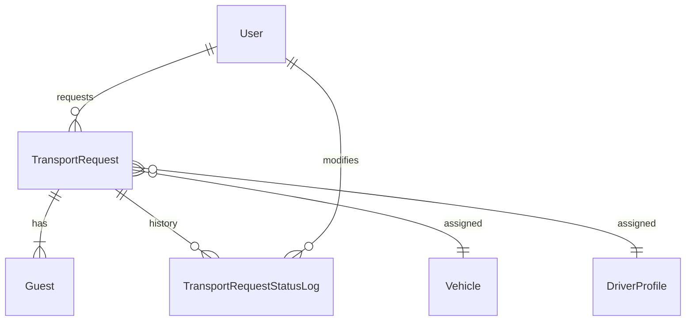

# Faculty Transport Request Models Implementation

**Date:** 2026-02-10
**Author:** Trae AI (on behalf of Pias)
**Status:** Implemented

## Overview
This document outlines the implementation of the database models required for the "Faculty Requesting Vehicle for Guests" feature. The implementation follows a **DB-First** approach to define the core request structure, guest details, and status tracking before implementing the API logic.

## New Models

### 1. `TransportRequest`
**File:** `app/models/transport_request.py`

Represents a faculty-initiated request for guest transport. It serves as the central entity for this feature, linking the requester (Faculty) with the fulfillment details (Vehicle/Driver assigned by TO).

**Key Fields:**
- **Identity & Context:**
  - `id` (UUID, PK)
  - `faculty_user_id` (FK -> `user.id`): The faculty member making the request.
  - `event_title` (String): Name of the workshop, event, etc.
  - `event_date` (Date): When the transport is needed.
  - `status` (String): Workflow state (`PENDING`, `APPROVED`, `DECLINED`, `ASSIGNED`, `COMPLETED`).

- **TO Assignment (Fulfillment):**
  - `assigned_vehicle_id` (FK -> `vehicle.id`, Nullable): The vehicle allocated for the trip.
  - `assigned_driver_profile_id` (FK -> `driver_profile.id`, Nullable): The driver allocated.
  - `assigned_by` (FK -> `user.id`, Nullable): The Transport Officer who processed the request.
  - `to_reply_message` (String, Nullable): Optional note from TO to Faculty.

### 2. `Guest`
**File:** `app/models/transport_request.py`

Stores information about individual guests associated with a specific transport request.

**Key Fields:**
- `id` (UUID, PK)
- `request_id` (FK -> `transport_request.id`): Link to the parent request.
- `name` (String): Guest's name.
- `pickup_location` (String): Specific pickup point for the guest.
- `notes` (String, Nullable): Special requirements.

**Design Decision:**
- Guest count is not stored as a static integer in `TransportRequest` to avoid data inconsistency. It should be derived by counting rows in this table.

### 3. `TransportRequestStatusLog`
**File:** `app/models/transport_request.py`

Provides an audit trail for all status changes of a request. This enables a "Timeline" view in the UI and ensures accountability.

**Key Fields:**
- `id` (UUID, PK)
- `request_id` (FK -> `transport_request.id`)
- `previous_status` (String, Nullable)
- `new_status` (String)
- `changed_by` (FK -> `user.id`): User who triggered the change (Faculty or TO).
- `note` (String, Nullable): Reason for change (e.g., rejection reason).
- `changed_at` (Timestamp): When the change occurred.

## Relationship Diagram (Conceptual)

## Next Steps
- Implement API Endpoints (CRUD) for Faculty to create requests.
- Implement API Endpoints for TO to view and approve/assign requests.
- Integrate with Notification system.
